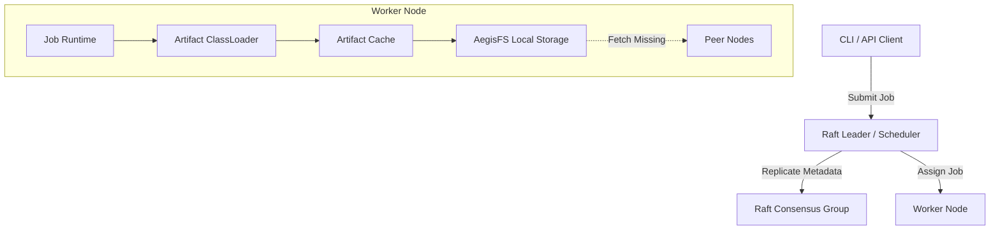

# AegisOS Architecture

## What is AegisOS?

AegisOS is a secure, peer-to-peer, distributed operating system runtime written in Java 21. It abstracts a cluster of commodity machines into a single unified computing and storage substrate. Instead of manually deploying JARs to servers or building heavyweight containers, developers upload raw bytecode artifacts directly into the cluster. AegisOS autonomously handles artifact replication, dynamic scheduling, distributed class-loading, and failure recovery.

The system is built on strong decentralization principles: there is no external database or centralized control plane. The nodes themselves cooperatively manage state using Raft consensus and discover each other via a Kademlia-inspired gossip protocol.

---

## High-Level Component Diagram



---

## How does a job flow through the system?

The journey of a job from submission to execution involves multiple decentralized subsystems working in concert:

1. **Submission:** A client uses the CLI to submit a `RunCommand`, specifying an `artifactId` (SHA-256 hash) and a `className`.
2. **Routing:** The request is routed to the current Raft Leader.
3. **Registration:** The Leader commits the `RUN_JOB` command to the Raft log.
4. **Scheduling:** The `Scheduler` module on the Leader detects the new pending job. It evaluates the cluster state (resource availability reported via gossip) and assigns the job to the most suitable worker node, committing an `ASSIGN_JOB` command to Raft.
5. **Execution Trigger:** The assigned worker node observes the `ASSIGN_JOB` commit. Its local `ProcessRuntimeAgent` takes ownership.
6. **Artifact Resolution:** The worker's `ArtifactCache` intercepts the execution. If the required artifact is not on the local disk, it asks `AegisFS` to fetch the chunks from peer nodes over the network.
7. **ClassLoading & Isolation:** Once cached, an isolated `ArtifactClassLoader` is created for this specific job, preventing dependency collisions with other running jobs.
8. **Execution:** The job is instantiated and executed on a virtual thread.
9. **Completion:** Upon success or failure, the worker updates the job status, committing the result back to the Raft log.

---

## How does storage work?

Storage in AegisOS (AegisFS) is designed to be immutable, chunked, and fiercely protective of data integrity.

```mermaid
flowchart LR
    Artifact[Raw JAR Artifact] -->|Chunking & Hash| Chunks[SHA-256 Chunks]
    Chunks -->|Encrypted via AES-GCM| Encrypted[Encrypted Chunks]
    Encrypted -->|Replicated RF=3| Network[Peer Nodes]
    
    subgraph AegisFS Metadata (Raft)
        FileIndex[(File Index)]
    end
    
    Network -.-> FileIndex
```

1. **Chunking:** Files are broken into fixed-size chunks.
2. **Metadata is Truth:** The mapping of a file to its constituent chunks, and the expected replica locations, is stored in the `FileIndex` — a state machine fully backed by Raft. 
3. **Physical Conformity:** The physical data on disk must always conform to the Raft metadata. The `AntiEntropyManager` constantly sweeps the disk, quarantining orphaned chunks that metadata doesn't recognize.
4. **Self-Healing:** If a node goes offline or data is silently corrupted, the `SelfHealingReaper` detects the drop in replication factor and orchestrates a repair by transferring the chunk from a healthy node to a new replica.

---

## How does recovery work?

AegisOS embraces failure as a normal operating condition.

1. **Leader Failure:** If the Raft Leader crashes, the remaining nodes detect the heartbeat timeout. A new election is triggered, and a new leader is established within milliseconds. Since all scheduling and job state is stored in the Raft log, the new leader seamlessly picks up where the old one left off.
2. **Worker Failure (Job Recovery):** If a worker executing a job crashes, the cluster detects the node's departure via gossip timeouts. The Scheduler (on the Leader) notices that a job is assigned to a `DEAD` node. It immediately re-queues the job and assigns it to a healthy node.
3. **Artifact Recovery (Storage):** The new worker, upon receiving the reassigned job, will dynamically fetch the required JAR artifact via AegisFS from other replicas, cache it locally, and resume execution. There is no manual intervention required.

---

## How does scheduling work?

Scheduling is decoupled from the Raft state machine but heavily relies on its strongly consistent log.

1. **Telemetry:** Every node constantly broadcasts its available CPU, memory, and active job count via the Kademlia discovery protocol.
2. **Placement:** The `Scheduler` runs exclusively on the Raft Leader. When it sees an unassigned job in the state machine, it runs a `PlacementAlgorithm`.
3. **Scoring:** The algorithm scores available nodes based on resource capacity, current load, and (planned) network latency.
4. **Commit:** The Scheduler selects the highest-scoring node and proposes an `ASSIGN_JOB` to the Raft consensus group. Only when the cluster agrees does the assignment become official.
