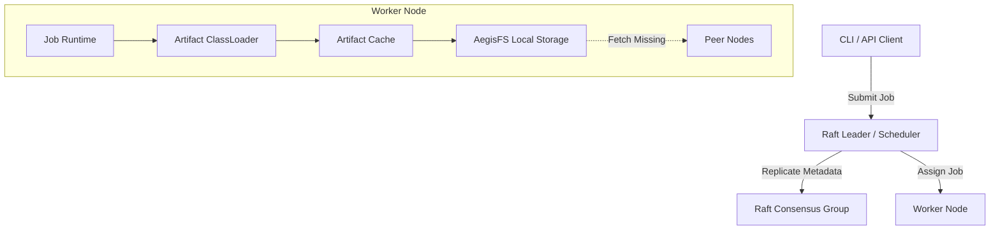
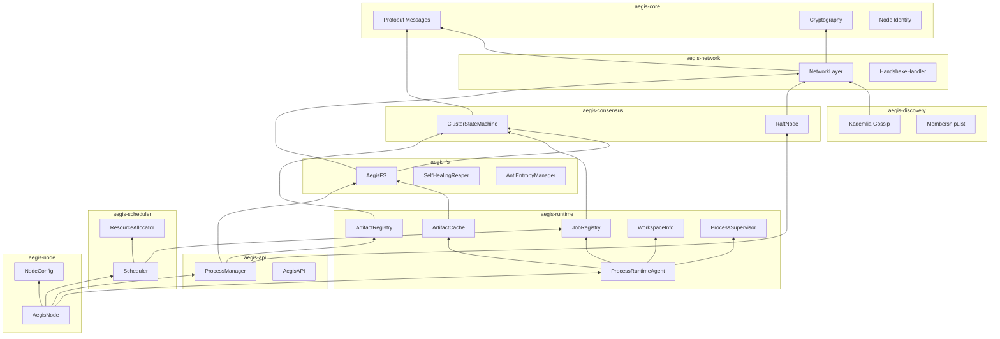
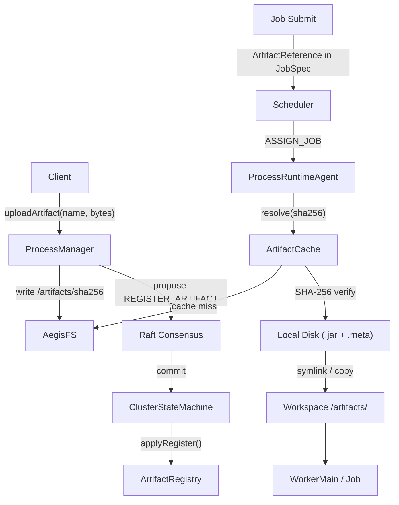

# AegisOS Architecture: What Exists?

## What is AegisOS?

AegisOS is a secure, peer-to-peer, distributed operating system runtime written in Java 21. It abstracts a cluster of commodity machines into a single unified computing and storage substrate. Instead of manually deploying JARs to servers or building heavyweight containers, developers upload raw bytecode artifacts directly into the cluster. AegisOS autonomously handles artifact replication, dynamic scheduling, distributed class-loading, and failure recovery.

The system is built on strong decentralization principles: there is no external database or centralized control plane. The nodes cooperatively manage state using Raft consensus and discover each other via a Kademlia-inspired gossip protocol.

---

## High-Level Component Diagram



---

## Component Dependency Graph



---

## Artifact Flow

Storage in AegisOS (AegisFS) is designed to be immutable, chunked, and fiercely protective of data integrity.



---

## Workspace Directory Layout

```text
/var/aegisos/workspaces/
└── <job-id>/
    └── exec-<execution-id>/
        ├── artifacts/          ← Mounted artifact files
        │   ├── model.bin       ← symlink → cache/<sha256>.jar
        │   └── config.json     ← symlink → cache/<sha256>.jar
        ├── scratch/            ← Job-private temporary storage
        ├── checkpoints/        ← Local checkpoint staging
        ├── stdout.log          ← Captured standard output
        └── stderr.log          ← Captured standard error
```

Key design decisions:
- The workspace is scoped to **execution ID**, not job ID. Retries and failovers receive fresh scratch space.
- Artifacts are **symlinked** from the cache to prevent duplication.
- Logs are uploaded to AegisFS upon job completion or failure for distributed persistence.
