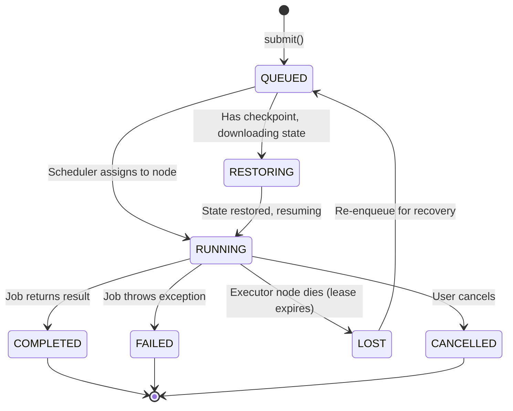
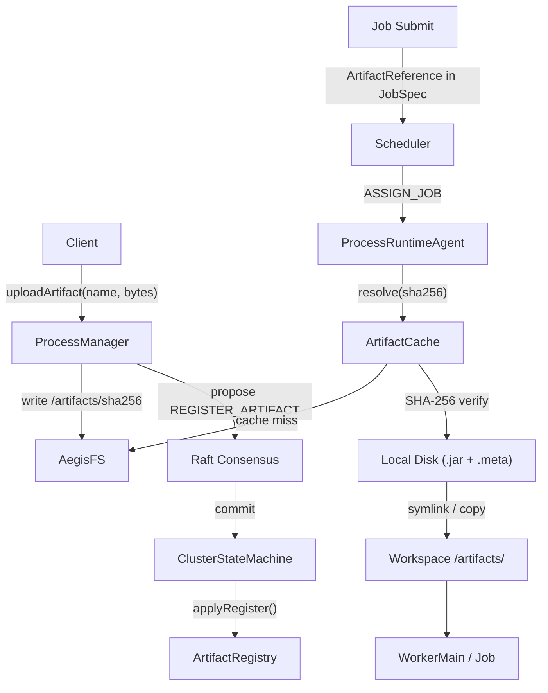
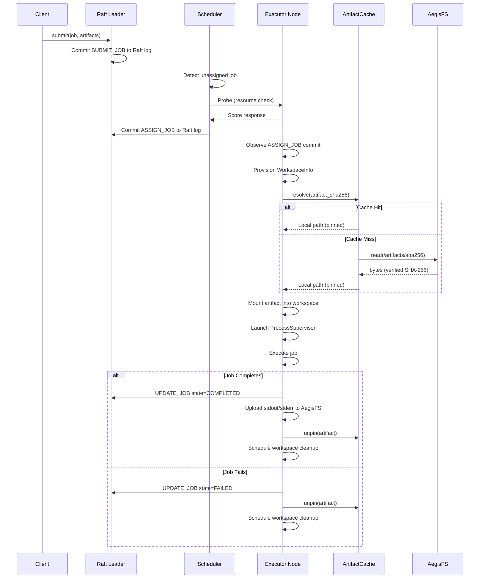
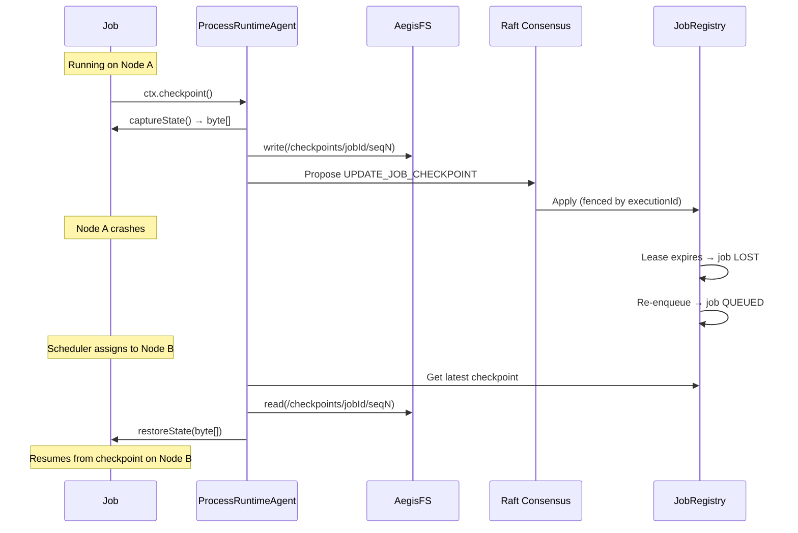
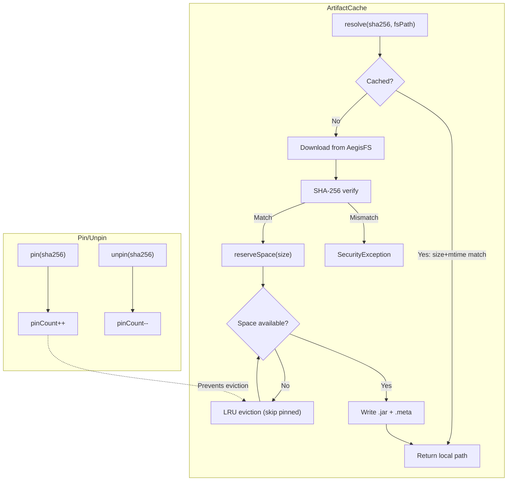
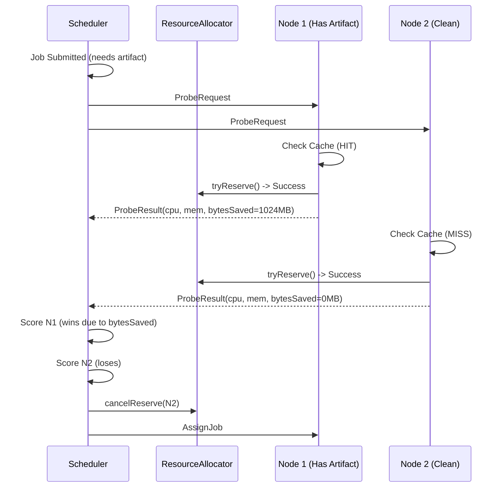
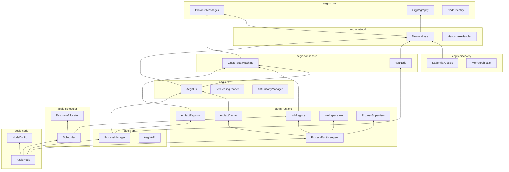
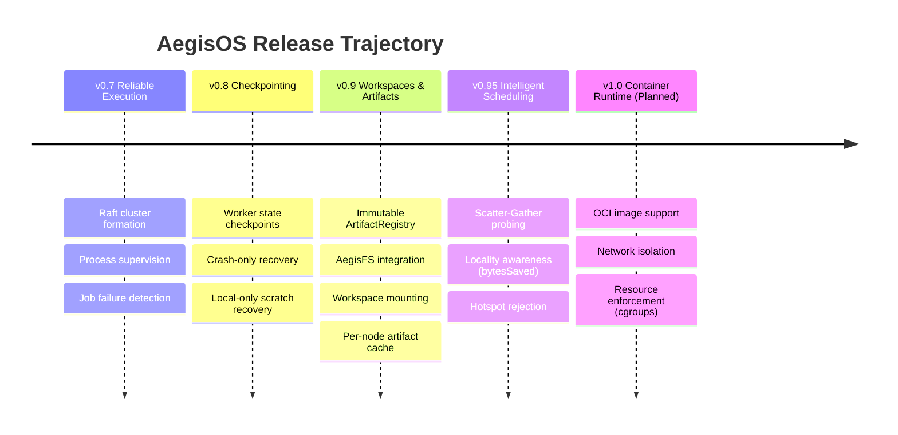

# AegisOS v0.95 Architecture Diagrams

---

## Table of Contents
1. [Job Lifecycle State Machine](#1-job-lifecycle)
2. [Artifact Flow](#2-artifact-flow)
3. [Execution Sequence Diagram](#3-execution-path-detail)
4. [Checkpoint & Recovery Flow](#4-checkpoint--recovery-flow)
5. [Workspace Directory Structure](#5-workspace-directory-structure)
6. [Artifact Cache Internals](#6-artifact-cache-internals)
7. [Intelligent Scheduling (New in v0.95)](#7-intelligent-scheduling-new-in-v095)
8. [Component Dependency Graph](#8-component-dependency-graph)
9. [Version History Timeline](#9-version-history-timeline)

---

## 1. Job Lifecycle



---

## 2. Artifact Flow



---

## 3. Execution Path (Detail)



---

## 4. Checkpoint + Recovery Flow



---

## 5. Workspace Directory Structure

```text
/var/aegisos/workspaces/
└── <job-id>/
    └── exec-<execution-id>/
        ├── artifacts/          ← Mounted artifact files
        │   ├── model.bin       ← symlink → cache/<sha256>.jar
        │   └── config.json     ← symlink → cache/<sha256>.jar
        ├── scratch/            ← Job-private temporary storage
        ├── checkpoints/        ← Local checkpoint staging
        ├── stdout.log          ← Captured standard output
        └── stderr.log          ← Captured standard error
```

Key design decisions:
- Workspace is scoped to **execution ID**, not job ID — retries get fresh scratch space
- Artifacts are **symlinked** from cache (copy fallback on Windows)
- Logs are uploaded to AegisFS on completion for persistence

---

## 6. Artifact Cache Internals



---

## 7. Intelligent Scheduling (New in v0.95)



---

## 8. Component Dependency Graph



---

## 9. Version History Timeline


