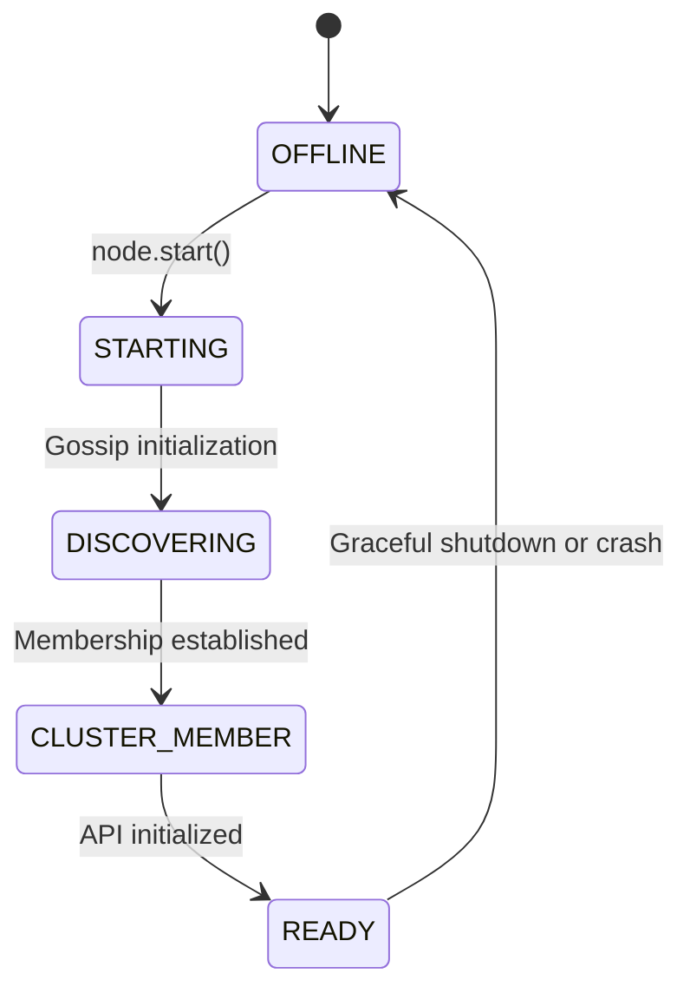
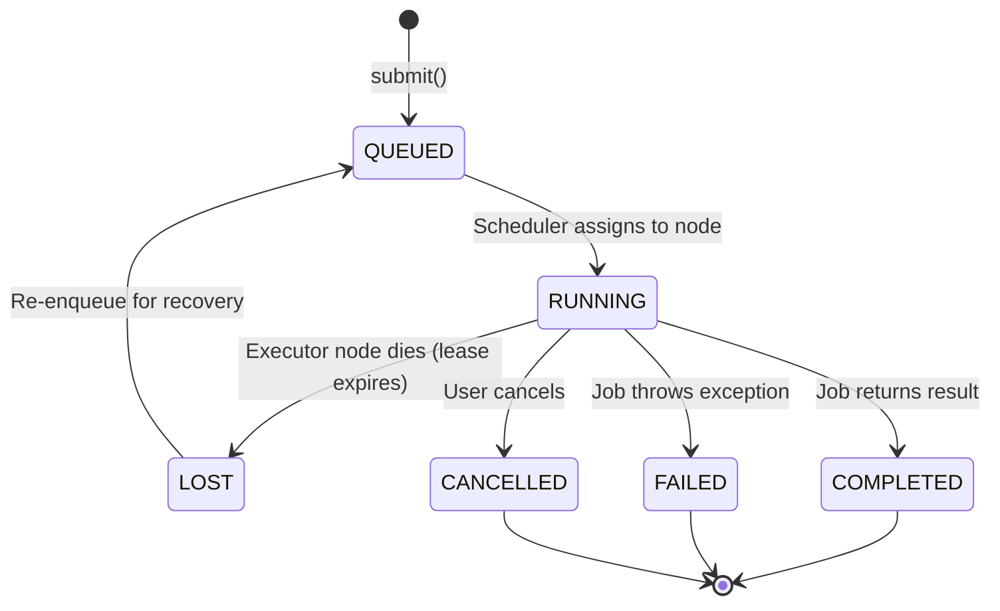
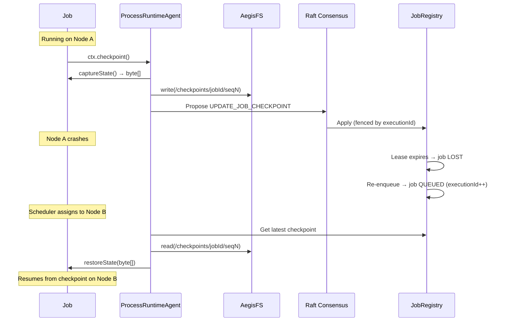

# AegisOS Lifecycle: How Does it Evolve?

This document outlines the temporal behavior of AegisOS, including the lifecycle of individual nodes as they join the cluster, and the execution lifecycle of submitted jobs.

---

## 1. Node Lifecycle

The Node Lifecycle dictates how a newly started instance boots up, discovers its peers, joins consensus, and ultimately becomes available to accept read/write workloads.

### Node Capabilities

As the node traverses the state machine, it gains capabilities. These capabilities are strictly exposed through semantic queries, allowing external clients or internal test harnesses to wait for the exact necessary contract.

*   `isReady()`: Indicates the node has started and its local API is initialized. It can serve read-only queries that do not require consensus.
*   `isWriteReady()`: Indicates that `isReady()` is true AND a Raft Leader has been successfully elected. The node is now capable of accepting write workloads (e.g. `uploadArtifact`, `submitJob`), which internally require proposing to the `ClusterStateMachine`.

---

## 2. Job Lifecycle

The Job Lifecycle defines how a submitted execution task flows through the system.

### 3. Checkpoint & Recovery Flow

When a node running an active job crashes, the system autonomously recovers the job on a different healthy node using the latest saved checkpoint.

