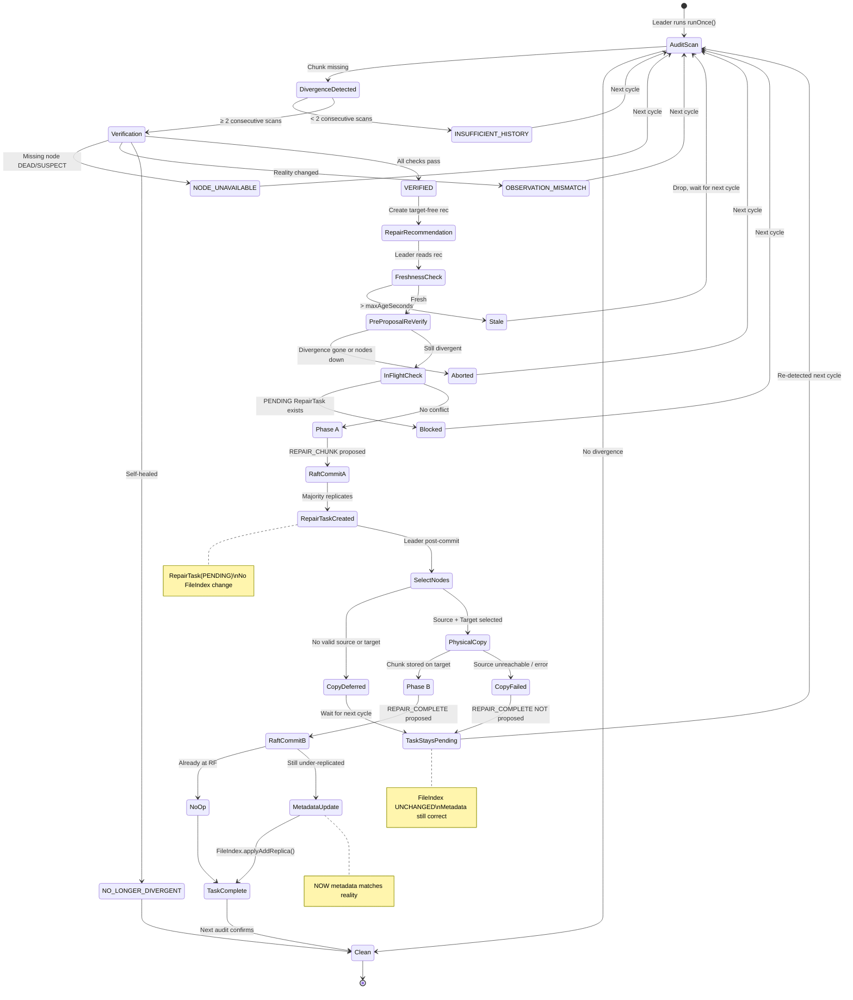

# Sprint 5 Design: Two-Phase Repair Execution

> [!IMPORTANT]
> This document MUST be reviewed and approved before any implementation begins.
> Sprint 5 is the first sprint that can move data and mutate cluster state.

> [!NOTE]
> **STATUS: APPROVED FOR IMPLEMENTATION**
>
> Revision 3 incorporates final review additions:
> 1. `REPAIR_COMPLETE` validates existing PENDING task (task existence guard).
> 2. Explicit task expiration rule: `committedAt + timeout < now → EXPIRED`.
> 3. `RepairLeaderFailoverTest` — new leaders do NOT continue half-finished repairs.
> 4. `SelfHealingReaper` deleted *after* acceptance tests pass, not before.

---

## 1. Scope

Sprint 5 implements **two-phase repair execution for `UNDER_REPLICATED` storage chunks only**.

It does NOT implement:
- Job repair
- Artifact repair
- Over-replication correction
- Corruption repair
- Automatic membership reconfiguration

Those are future sprints.

---

## 2. Core Design Principle

**Metadata equals reality at every committed state transition.**

```text
REPAIR_CHUNK commits     → RepairTask(PENDING) created → FileIndex UNCHANGED
Physical copy executes   → chunk physically on target  → FileIndex UNCHANGED
REPAIR_COMPLETE commits  → FileIndex.applyAddReplica() → FileIndex MATCHES reality
```

If the physical copy fails at any point:
- `REPAIR_COMPLETE` is never proposed.
- `FileIndex` is never mutated.
- Metadata still correctly shows under-replication.
- The audit pipeline re-detects naturally.

---

## 3. State Machine Flow



---

## 4. Protobuf Changes

### New CommandType Values

```protobuf
// In CommandType enum:
REPAIR_CHUNK    = 14;
REPAIR_COMPLETE = 15;
```

### New Messages

```protobuf
// Phase A: Records the FACT that repair is authorized.
// Contains NO operational data (no source, no target).
message RepairChunk {
  string repair_id              = 1;  // UUID, unique per repair attempt
  bytes  chunk_id               = 2;  // which chunk needs repair
  repeated int64 evidence_scans = 3;  // scan IDs from verification
  int64  verified_at            = 4;  // timestamp of verification
}

// Phase B: Records the RESULT of a successful physical copy.
// Contains operational data because it reflects reality.
message RepairComplete {
  string repair_id      = 1;  // matches the REPAIR_CHUNK repair_id
  bytes  file_id        = 2;  // resolved during copy execution
  bytes  chunk_id       = 3;
  bytes  target_node_id = 4;  // where the chunk was actually stored
  bytes  source_node_id = 5;  // where it was fetched from (audit trail)
}
```

---

## 5. Component Design

### 5.1 RepairTaskStore (NEW)

**Package:** `com.aegisos.fs.audit`

**Responsibility:** Raft-replicated state tracking pending and completed repairs.

```java
public final class RepairTaskStore {

    public enum TaskStatus { PENDING, COMPLETE, EXPIRED }

    public static final class RepairTask {
        String repairId;
        String chunkIdHex;
        List<Long> evidenceScans;
        long verifiedAt;
        long committedAt;
        TaskStatus status;
    }

    /** Applied when REPAIR_CHUNK is committed. */
    public void applyRepairChunk(long index, RepairChunk cmd);

    /** Applied when REPAIR_COMPLETE is committed. */
    public void applyRepairComplete(long index, RepairComplete cmd);

    /** Returns true if there's a PENDING task for this chunk. */
    public boolean hasPendingRepair(String chunkIdHex);

    /** Returns the PENDING task for a chunk, if any. */
    public Optional<RepairTask> pendingFor(String chunkIdHex);

    /** All current tasks (for REST API). */
    public List<RepairTask> all();

    /** Leader cleanup: expire tasks older than timeout. */
    public List<RepairTask> expireStaleTasks(long maxAgeMs);

    /** Returns the PENDING task matching a repairId, if any. */
    public Optional<RepairTask> pendingByRepairId(String repairId);
}
```

---

### 5.2 RepairProposer (NEW)

**Package:** `com.aegisos.fs.audit`

**Responsibility:** Reads `RepairRecommendation` list from `StorageAuditScheduler`,
validates freshness, re-verifies reality, and proposes `REPAIR_CHUNK`.
After commit, selects nodes, executes physical copy, proposes `REPAIR_COMPLETE`.

```java
public final class RepairProposer {

    private final StorageAuditScheduler auditScheduler;
    private final ConsensusModule consensus;
    private final AegisFS fileSystem;
    private final DiscoveryService discovery;
    private final NetworkLayer network;
    private final NodeId self;
    private final RepairTaskStore taskStore;
    private final long maxAgeMs;  // configurable: repairRecommendationMaxAgeSeconds

    /**
     * Phase A: Evaluates recommendations and proposes REPAIR_CHUNK
     * for those that pass all guards.
     * Called after runOnce() on the leader.
     */
    public List<RepairOutcome> proposeRepairs();

    /**
     * Phase B: For each PENDING RepairTask on this leader,
     * attempt physical copy and propose REPAIR_COMPLETE on success.
     * Called after proposeRepairs() on the leader.
     */
    public List<RepairOutcome> executeAndComplete();

    // --- Guards ---

    boolean isFresh(RepairRecommendation rec);
    boolean reVerifyDivergence(RepairRecommendation rec);
    boolean hasBlockingTask(String chunkIdHex);

    // --- Operational decisions (outside Raft) ---

    Optional<NodeId> selectSource(String chunkIdHex, FileMetadata metadata);
    Optional<NodeId> selectTarget(String chunkIdHex, FileMetadata metadata);
}
```

---

### 5.3 RepairOutcome (NEW)

**Package:** `com.aegisos.fs.audit`

```java
public final class RepairOutcome {
    public enum Status {
        REPAIR_PROPOSED,    // Phase A: REPAIR_CHUNK submitted
        COPY_SUCCEEDED,     // Phase B: physical copy done, REPAIR_COMPLETE submitted
        COPY_FAILED,        // Phase B: physical copy failed, staying PENDING
        STALE,              // Recommendation too old
        NO_LONGER_NEEDED,   // Re-verification shows healed
        NO_SOURCE,          // No ALIVE node holds the chunk
        NO_TARGET,          // No valid target node available
        BLOCKED,            // PENDING RepairTask already exists for this chunk
        PROPOSAL_FAILED     // Raft proposal rejected
    }

    private final String chunkId;
    private final Status status;
    private final String details;
    private final String repairId;  // null if not proposed
}
```

---

### 5.4 State Machine Changes

#### In `AegisFS.registerAppliers()`:

```java
// Phase A: Create PENDING repair task (no FileIndex mutation)
consensus.stateMachine().register(CommandType.REPAIR_CHUNK, (index, cmd) -> {
    try {
        RepairChunk repair = RepairChunk.parseFrom(cmd.getPayload());
        repairTaskStore.applyRepairChunk(index, repair);
        log.info("REPAIR_CHUNK at {}: task {} created for chunk {}",
            index, repair.getRepairId(), HexUtil.encode(repair.getChunkId()));
    } catch (Exception e) {
        log.warn("bad REPAIR_CHUNK at {}", index);
    }
});

// Phase B: Validate PENDING task, update FileIndex, mark task complete
consensus.stateMachine().register(CommandType.REPAIR_COMPLETE, (index, cmd) -> {
    try {
        RepairComplete complete = RepairComplete.parseFrom(cmd.getPayload());

        // Task existence guard: must have a matching PENDING task
        Optional<RepairTaskStore.RepairTask> task =
            repairTaskStore.pendingByRepairId(complete.getRepairId());
        if (task.isEmpty()) {
            log.info("REPAIR_COMPLETE at {} ignored: no PENDING task for {}",
                index, complete.getRepairId());
            return;
        }

        // Idempotency guard: skip if already at RF
        if (!isStillUnderReplicated(complete.getChunkId(), complete.getFileId())) {
            repairTaskStore.applyRepairComplete(index, complete);
            log.info("REPAIR_COMPLETE at {} is no-op: chunk already at RF", index);
            return;
        }

        // Metadata mutation: NOW FileIndex matches reality
        fileIndex.applyAddReplica(AddReplica.newBuilder()
            .setFileId(complete.getFileId())
            .setChunkId(complete.getChunkId())
            .setNodeId(complete.getTargetNodeId())
            .build());
        repairTaskStore.applyRepairComplete(index, complete);
    } catch (Exception e) {
        log.warn("bad REPAIR_COMPLETE at {}", index);
    }
});
```

---

### 5.5 StorageAuditScheduler Changes

Add repair proposal and execution phases to `runOnce()`:

```java
public void runOnce() {
    // ... existing steps 1-6 (audit + verify + recommend) ...

    // Step 7: Phase A — propose REPAIR_CHUNK for verified recommendations
    if (repairProposer != null && isLeader.getAsBoolean()) {
        List<RepairOutcome> phaseA = repairProposer.proposeRepairs();
        // Step 8: Phase B — execute pending repairs and propose REPAIR_COMPLETE
        List<RepairOutcome> phaseB = repairProposer.executeAndComplete();
        currentRepairOutcomes = merge(phaseA, phaseB);
    }
}
```

---

### 5.6 REST API Additions

```
GET /audit/repairs     → RepairOutcome list (what was proposed/completed/deferred/failed)
GET /audit/tasks       → RepairTask list from RepairTaskStore (PENDING/COMPLETE/EXPIRED)
```

---

## 6. Legacy Code Removal

### Implementation Order

`SelfHealingReaper` is deleted **after** all acceptance tests pass:

1. Build Sprint 5 repair pipeline (SelfHealingReaper remains temporarily).
2. Pass `RepairExecutionSignOffTest`, `RepairCopyFailureTest`, `RepairLeaderFailoverTest`.
3. **Then** delete `SelfHealingReaper.java` and update all references.

Rationale: if Sprint 5 stalls halfway, the old repair mechanism still functions.

### References to Update (at step 3)

| File | Change |
|------|--------|
| [AegisNode.java](file:///c:/Users/astra/Desktop/projects/AgeisOS/aegis-node/src/main/java/com/aegisos/node/AegisNode.java) | Remove import, field, construction (lines 12, 53, 121-122), and close() call |
| [ChaosSoakTest.java](file:///c:/Users/astra/Desktop/projects/AgeisOS/aegis-test-cluster/src/test/java/com/aegisos/cluster/ChaosSoakTest.java) | Update self-healing comments/waits to reference new pipeline |
| [Phase10ChaosMarathonTest.java](file:///c:/Users/astra/Desktop/projects/AgeisOS/aegis-test-cluster/src/test/java/com/aegisos/cluster/Phase10ChaosMarathonTest.java) | Update self-healing comments/waits to reference new pipeline |
| [Phase9Test.java](file:///c:/Users/astra/Desktop/projects/AgeisOS/aegis-test-cluster/src/test/java/com/aegisos/cluster/Phase9Test.java) | Update self-healing comments |

---

## 7. Failure Modes

| # | Scenario | Defense | Recovery | Metadata Correctness |
|---|----------|---------|----------|---------------------|
| F1 | Source lost during copy | Copy fails, REPAIR_COMPLETE not proposed | Next audit re-detects | ✅ FileIndex unchanged |
| F2 | Double repair race | PENDING RepairTask blocks second proposal | Only one repair per chunk | ✅ No double mutation |
| F3 | Repair after self-heal | Pre-proposal re-verify + leader skips copy | No-op | ✅ No stale mutation |
| F4 | Leadership transfer mid-repair | Committed: new leader sees PENDING task but doesn't execute it. Not committed: dropped. | Task expires, new leader builds fresh history | ✅ No orphaned metadata |
| F5 | Target dies after REPAIR_COMPLETE | Metadata says chunk on target | Next audit: NODE_UNAVAILABLE | ⚠️ Correct until reconfiguration |
| F6 | No healthy source | Copy deferred, task stays PENDING | Operator intervention | ✅ FileIndex unchanged |
| F7 | Stale recommendation | Freshness check drops it | Next cycle re-evaluates | ✅ No proposal |
| F8 | Copy fails (explicit) | REPAIR_COMPLETE NOT proposed | Next cycle retries | ✅ FileIndex unchanged |

---

## 8. Acceptance Tests

### Test 1: `RepairExecutionSignOffTest` (7 phases)

#### Phase 1 — Baseline
1. Boot 3-node cluster (A=leader, B, C).
2. Write file with RF=3.
3. Run `runOnce()` on leader.
4. Assert: no divergence, no recommendation, no repair.

#### Phase 2 — Induce Under-Replication
5. Physically delete chunk replica on node C.
6. Run `runOnce()` — first scan.
7. Assert: divergence detected, `INSUFFICIENT_HISTORY`, no repair proposed.

#### Phase 3 — Verification
8. Run `runOnce()` — second scan.
9. Assert: `VERIFIED` recommendation exists.

#### Phase 4 — Two-Phase Repair
10. Assert: `REPAIR_CHUNK` was proposed and committed.
11. Assert: `RepairTaskStore` has a `PENDING` task.
12. Assert: **FileIndex has NOT changed yet** (no ADD_REPLICA applied).
13. Assert: Physical chunk now exists on target node.
14. Assert: `REPAIR_COMPLETE` was proposed and committed.
15. Assert: `FileIndex` now shows chunk on target node.
16. Assert: `RepairTaskStore` task is `COMPLETE`.

#### Phase 5 — Post-Repair Verification
17. Run `runOnce()` — third scan.
18. Assert: no divergence, no recommendation, no repair proposed.

#### Phase 6 — Idempotency
19. Re-propose the same `REPAIR_COMPLETE` manually.
20. Assert: state machine treats it as no-op (already at RF).

#### Phase 7 — Follower Verification
21. On a follower node, verify:
    - `FileIndex` reflects the `REPAIR_COMPLETE` metadata change.
    - `RepairTaskStore` shows the task as `COMPLETE`.
    - NO physical copy was triggered on the follower.
    - `StorageAuditScheduler` did not run (leadership check).

---

### Test 2: `RepairCopyFailureTest` (4 phases)

#### Phase 1 — Setup
1. 3-node cluster, write file with RF=3.
2. Delete chunk replica on node C.
3. Run 2× `runOnce()` → `VERIFIED` recommendation.

#### Phase 2 — Force Copy Failure
4. `REPAIR_CHUNK` commits (RepairTask PENDING).
5. Make copy fail (e.g., network partition to all source nodes, or inject failure).
6. Assert: `REPAIR_COMPLETE` was NOT proposed.
7. Assert: **FileIndex unchanged** — still shows RF=2 metadata.
8. Assert: `RepairTaskStore` task is still `PENDING`.

#### Phase 3 — Verify Audit Consistency
9. Run `runOnce()` again.
10. Assert: audit still reports chunk as under-replicated.
11. Assert: recommendation still exists (or is re-generated).

#### Phase 4 — Recovery
12. Restore network / remove failure injection.
13. Run `runOnce()` again.
14. Assert: repair succeeds this time (new `REPAIR_CHUNK` + copy + `REPAIR_COMPLETE`).
15. Assert: FileIndex now correct.

---

### Test 3: `RepairLeaderFailoverTest` (5 phases)

#### Phase 1 — Setup and Divergence
1. Boot 3-node cluster (A=leader, B, C).
2. Write file with RF=3.
3. Delete chunk replica on node C.
4. Run 2× `runOnce()` on leader A → `VERIFIED` recommendation.

#### Phase 2 — Phase A Commits, Leader Dies
5. `REPAIR_CHUNK` commits (RepairTask PENDING).
6. Kill leader A **before** physical copy executes.
7. Wait for leader B to be elected.

#### Phase 3 — New Leader State Verification
8. Assert: `FileIndex` unchanged on leader B (no `REPAIR_COMPLETE` applied).
9. Assert: `RepairTaskStore` on leader B shows task as `PENDING`.
10. Assert: leader B does **NOT** automatically execute the physical copy.

#### Phase 4 — New Leader Re-Verifies and Completes
11. Wait for PENDING task to expire (or set short timeout for test).
12. Run `runOnce()` on leader B — builds fresh audit history.
13. Run `runOnce()` again on leader B — `VERIFIED` recommendation.
14. Assert: new `REPAIR_CHUNK` proposed and committed.
15. Assert: physical copy succeeds.
16. Assert: `REPAIR_COMPLETE` committed.
17. Assert: `FileIndex` now correct.

#### Phase 5 — Post-Repair Clean
18. Run `runOnce()` on leader B.
19. Assert: no divergence, no recommendation.

---

## 9. Configuration

| Parameter | Default | Description |
|-----------|---------|-------------|
| `repairRecommendationMaxAgeSeconds` | `180` | Staleness window for recommendations |
| `repairTaskTimeoutSeconds` | `300` | Timeout for PENDING tasks before expiry |

---

## 10. Files to Create/Modify

### New Files
| File | Purpose |
|------|---------|
| `aegis-fs/.../audit/RepairTaskStore.java` | Raft-replicated repair task tracking |
| `aegis-fs/.../audit/RepairProposer.java` | Two-phase repair proposal + execution |
| `aegis-fs/.../audit/RepairOutcome.java` | Proposal/execution outcome data |
| `aegis-test-cluster/.../RepairExecutionSignOffTest.java` | Sprint 5 sign-off (7 phases) |
| `aegis-test-cluster/.../RepairCopyFailureTest.java` | Copy failure safety test |
| `aegis-test-cluster/.../RepairLeaderFailoverTest.java` | Leader failover between phases test |

### Modified Files
| File | Change |
|------|--------|
| `aegis.proto` | Add `REPAIR_CHUNK=14`, `REPAIR_COMPLETE=15`, `RepairChunk`, `RepairComplete` messages |
| `AegisFS.java` | Register `REPAIR_CHUNK` + `REPAIR_COMPLETE` appliers, hold `RepairTaskStore` |
| `StorageAuditScheduler.java` | Add repair proposal + execution phases to `runOnce()` |
| `MetricsServer.java` | Add `GET /audit/repairs` and `GET /audit/tasks` endpoints |
| `AegisNode.java` | Wire `RepairProposer`, `RepairTaskStore` |

### Deleted Files (after acceptance tests pass)
| File | Reason |
|------|--------|
| `SelfHealingReaper.java` | ADR-016/017/019 violation. Replaced by new repair pipeline. |

### No Changes
| File | Reason |
|------|--------|
| `StorageVerifier.java` | Unchanged — verification is Sprint 4 scope |
| `RepairRecommendation.java` | Unchanged — still target-free |
| `ClusterConfiguration.java` | Unchanged — membership is Sprint 3 scope |
